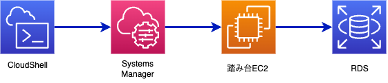
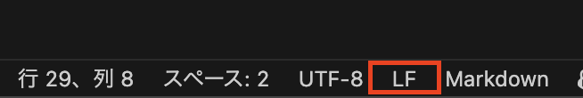
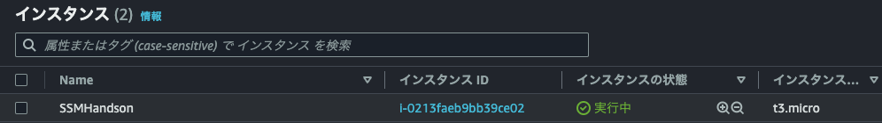

# Systems Manager ハンズオンセットアップ

それではハンズオンを開始します。  
お伝えした IAM ユーザーで AWS マネジメントコンソールへログインします。  

右上のメニュー部分にある CloudShell ボタンをクリックして CloudShell を開きます。  
   

本ハンズオンは CloudShell をローカル PC に見立てて進めます。    


## Windonw PC を使う場合

Windows PC で本リポジトリをクローンして使う場合はテキストエディタの改行コードを LF に変更してください。  

VSCode の場合は右下にある改行コードをクリックして LF に変更します。  



## ハンズオン用 EC2 インスタンス（踏み台）の作成

以下のコマンドで EC2 インスタンスを作成します。  
自分専用のインスタンスになりますので、必ず **MYNAME** 変数を設定するようにしてください。  

```bash
# 自分を識別しやすい文字列、例えば名前を入力します。
MYNAME="yoshii"

AWS_PAGER=""

cat > tagspec.json << EOF
[
    {
        "ResourceType": "instance",
        "Tags": [
            {
                "Key": "Name",
                "Value": "${MYNAME}_SSMHandson"
            }
        ]
    },
    {
        "ResourceType": "volume",
        "Tags": [
            {
                "Key": "Name",
                "Value": "${MYNAME}_SSMHandson}"
            }
        ]
    }
]
EOF

aws ec2 run-instances \
  --image-id resolve:ssm:/aws/service/ami-amazon-linux-latest/amzn2-ami-hvm-x86_64-gp2 \
  --instance-type t3.micro \
  --iam-instance-profile Name=ec2_instance_profile \
  --metadata-options HttpTokens=required \
  --subnet-id subnet-0d9b6fd29bb54b16f \
  --security-group-ids sg-02d92d819799aee74 \
  --associate-public-ip-address \
  --tag-specifications file://tagspec.json
```

マネジメントコンソールで EC2 画面を開いてください。  
**${MYNAME}_SSMHandson** という名前のインスタンスが起動しているはずです。  




## 解説

ハンズオンを実施するための事前準備を行いました。  

Session Manager 経由で AWS リソースを操作するための踏み台サーバーを作成しました。  
踏み台サーバーには SSM(Systems Manager) を操作するための最小権限を持ったインスタンスプロファイルを割り当てています。これらの権限はインスタンスにインストールされている SSM Agent が正しく動作するために必要です。    


本ハンズオンでは CloudShell を使用します。  
ご自身の PC を使う場合は AWS CLI のインストールと設定、Session Manager プラグインのインストールを行ってください。  

[AWS CLI の最新バージョンを使用してインストールまたは更新を行う](https://docs.aws.amazon.com/ja_jp/cli/latest/userguide/getting-started-install.html#cliv2-linux-install)  
[AWS CLI をセットアップする](https://docs.aws.amazon.com/ja_jp/cli/latest/userguide/getting-started-quickstart.html)  
[AWS CLI 用の Session Manager プラグインをインストールする](https://docs.aws.amazon.com/ja_jp/systems-manager/latest/userguide/session-manager-working-with-install-plugin.html)  


 [前へ](./README.md) &nbsp; &nbsp; &nbsp; &nbsp; &nbsp; &nbsp; &nbsp; &nbsp; [次へ](./chapter02.md) 


