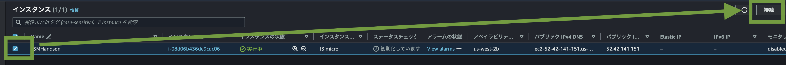
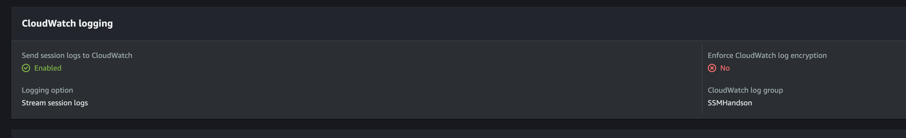
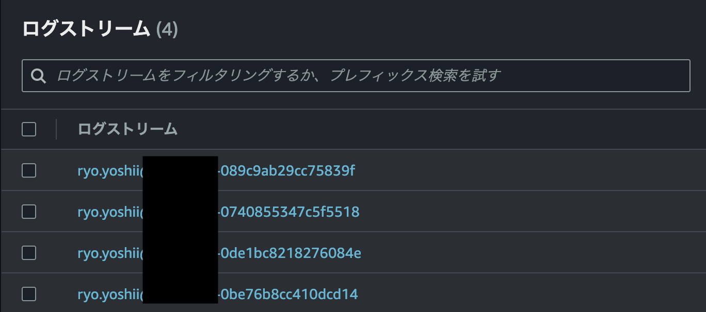

# Session Manager で EC2 へログイン

Session Manager を使用すると、EC2 インスタンスに SSH や RDP などのポートを開けることなく、暗号化された経路でログインできます。  
AWS CLI またはマネジメントコンソールからリモートセッションを開始できます。  
伝統的な踏み台サーバーを用意する必要はありません。SSH キーの管理といった面倒な作業も不要です。    

Session Manager には以下のような利点があります。  

- IAM を利用したアクセス管理
- 受信ポートを開ける必要がない
- AWS CLI またはマネジメントコンソールからログイン
- EC2 インスタンスとオンプレミスサーバーの両方に対応
- ポートフォワーディングによるリモートアクセス
- Windows、Linux、macOS に対応
- セッションログの記録

## マネジメントコンソールからログイン

マネジメントコンソールから Session Manager を使用して EC2 インスタンスにログインします。  

[EC2](https://ap-northeast-1.console.aws.amazon.com/ec2/home#Instances:) 画面を開きます。  

[Chapter 1](./chapter01.md) で作成した EC2 インスタンスを使用します。そのインスタンスのチェックボックスを選択して、上部の `接続` ボタンをクリックします。  
  
  
`セッションマネージャー` タブから `接続` ボタンをクリックします。  

ブラウザの別タブが開き、背景が黒いコンソール画面が表示されます。これで接続完了です。  

試しに簡単なコマンドを実行してみましょう。  

※Windowsを使用している場合、[Ctrl]+[v]によるペーストができないので右クリックでペーストしてください。

```bash
date

uname -n

whoami
```

セッションを終了するには、コンソール画面の右上にある `終了` ボタンをクリックします。  


## AWS CLI からログイン

続いて AWS CLI からログインしてみます。  

CloudShell で以下のコマンドを実行します。  

```bash
MYID=$(aws ec2 describe-instances --filters Name=tag:Name,Values=${MYNAME}_SSMHandson --query 'Reservations[].Instances[].InstanceId' --output text)

aws ssm start-session --target ${MYID}
```

プロンプトが `sh-4.2$` に変わり、コマンドを実行できるようになります。  

試しに簡単なコマンドを実行してみましょう。  

※Windowsを使用している場合、[Ctrl]+[v]によるペーストができないので右クリックでペーストしてください。

```bash
date

uname -n

whoami
```

セッションを終了するには、`exit` と入力してエンターキーを押します。  

```bash
exit
```

## セッションデータの記録

Session Manager 経由でログインした際のコマンド実行履歴を記録します。  
S3 と CloudWatch Logs の何れか、または、両方に記録することができます。このハンズオンでは CloudWatch Logs に記録します。  

### 初期設定

[Session Manager の設定](https://ap-northeast-1.console.aws.amazon.com/systems-manager/session-manager/preferences?region=ap-northeast-1) 画面を開きます。  
**CloudWatch logging** で設定の有効化、ロググループの指定を行います。（本ハンズオンでは予め設定してあります）



### セッション開始

Session Manager でインスタンスにログインしている場合は一度ログアウトします。  
[AWS CLI からログイン](#AWS-CLI-からログイン) の手順を再度実行します。  

```bash
aws ssm start-session --target ${MYID}

Starting session with SessionId: ryo.yoshii@mixi.co.jp-0740855347c5f5518  # ここの SessionId がログストリーム名になります

sh-4.2$ date
```

### ログ表示

[CloudWatch Logs](https://us-west-2.console.aws.amazon.com/cloudwatch/home?region=ap-northeast-1#logsV2:log-groups/log-group/SSMHandson) 画面を開きます。  
CloudWatch Logs のロググループ `SSMHandson` にログストリームが作成されています。それを開きます。  

実行したコマンドとその結果が表示されています。  




## 解説

マネジメントコンソール、または、 AWS CLI で Session Manager を使用して EC2 インスタンスにログインしました。  
SSH 鍵やセキュリティグループでの TCP 22番開放の設定が不要であることが理解できました。  
OS ユーザーの準備も不要でアクセス管理は IAM ユーザーに一元化されています。  

セッションログの記録を有効にすることで、誰がいつどのような操作を行ったかを確認できます。  
監査の観点からも重要な機能です。  

 [前へ](./chapter01.md) &nbsp; &nbsp; &nbsp; &nbsp; &nbsp; &nbsp; &nbsp; &nbsp; [次へ](./chapter03.md) 
