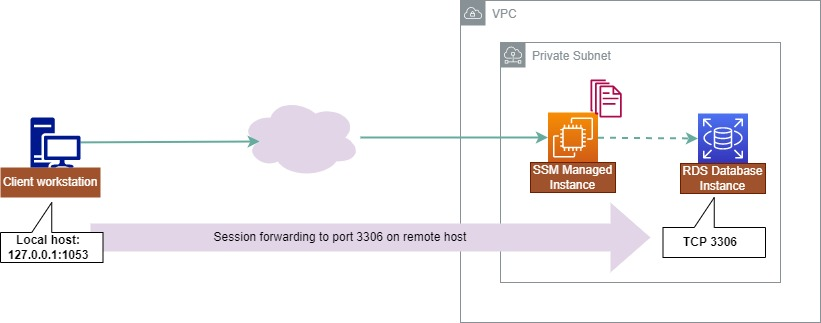
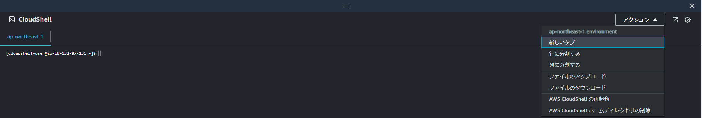

# Session Manager Port Forwarding を使った DB 接続

Port Forwarding を使用して VPC 内のインスタンスへ接続する方法を学びます。  
Chapter02 では Session Manager を使用して EC2 インスタンスへ接続しました。
ただ、Session Manager 接続先インスタンスにはインターネットアクセスが必要です。  
プライベートサブネットにあるインスタンスに Session Manager で接続ために Port Forwarding を使用します。  
今回のハンズオンのように SSM Agent をインストールできない RDS にも応用できます。  

参考：https://aws.amazon.com/jp/blogs/news/use-port-forwarding-in-aws-systems-manager-session-manager-to-connect-to-remote-hosts-jp/


# Port ForwardingでRDSに接続する

Port Forwardingを使う前に、一度構成を確認してみましょう。  

Chapter01で作成した踏み台サーバーが、以下の図の「SSM Managed Instance」に該当します。  



（引用：https://aws.amazon.com/jp/blogs/news/use-port-forwarding-in-aws-systems-manager-session-manager-to-connect-to-remote-hosts-jp/ ）

また、今回はCloudShellを使用しているため、「Client workstation」がCloudShellに該当します。

構成を確認したところで、実際にPort ForwardingでRDSに接続していきます。

まずは、CloudShellと踏み台サーバーの間でセッションを貼ります。

```
aws ssm start-session --target <踏み台サーバーのインスタンスID> --document-name AWS-StartPortForwardingSessionToRemoteHost --parameters '{"portNumber":["3306"],"localPortNumber":["1053"],"host":["<RDSのエンドポイント>"]}'
```

以下のような表示がされて入力待ちの状態になったら、CloudShellと踏み台サーバーの間でセッションが張られてます。

```
Starting session with SessionId: xxxxx-xxxxxxxxxxxxxxxxx
Port 1053 opened for sessionId xxxxx-xxxxxxxxxxxxxxxxx.
Waiting for connections...

```

別のターミナル画面からRDSへ接続するので、右上の[アクション]から[新しいタブ]をクリックして新しいターミナル画面を開きます。



新しいターミナルが開いたら、以下のコマンドでRDSに接続します。

```
mysql -h 127.0.0.1 --port 1053 -u mymasteruser -pmymasteruser
```

以下のような画面が出てきたら、RDSへの接続が成功しています

```
Welcome to the MariaDB monitor.  Commands end with ; or \g.
Your MySQL connection id is xxx
Server version: x.x.x Source distribution

Copyright (c) 2000, 2018, Oracle, MariaDB Corporation Ab and others.

Type 'help;' or '\h' for help. Type '\c' to clear the current input statement.

MySQL [(none)]>
```

## 解説

Port Forwarding を使用することで、プライベートサブネットにあるインスタンスにも Session Manager を使用して接続できるようになります。  
プライベートサブネットにインスタンスを配置することは、合理的な構成です。プライベートサブネットのインスタンス管理に、Session Manager を使用することでセキュリティを確保しつつ、運用を効率化できます。

 [前へ](./chapter02.md) &nbsp; &nbsp; &nbsp; &nbsp; &nbsp; &nbsp; &nbsp; &nbsp; [次へ](./chapter04.md) 
