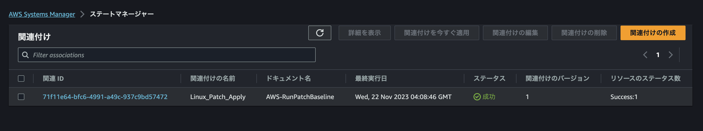

# State Manager による EC2 管理

State Manager を使うと AWS リソースを希望する状態に保つことが可能です。  
例えば EC2 インスタンスに CloudWatch エージェントをインストールする、起動時または特定時間にシェルスクリプトを実行する、といった管理タスクを自動化します。  

State Manager は **関連付け** を行います。関連付けを行うことで AWS リソースの状態を管理します。関連付けるターゲットはタグやインスタンス ID など複数の指定方法をサポートします。  

関連付けの中で Automation または RunCommand を指定します。これにより管理タスクが実行されます。cron や rate 式を使用して柔軟なスケジューリングをサポートします。  
また、スケジュール以外にも次の状況でも関連付けが実行されます。  

- 関連付けの編集
  - 次の何れかのフィールド: DOCUMENT_VERSION, PARAMETERS, SCHEDULE_EXPRESSION, OUTPUT_S3_LOCATION
- ドキュメントの編集
  - 新しい$DEFAULT バージョンを使用
  - ドキュメントを更新後、$LATEST バージョンを使用
  - 関連付けで定義されていたドキュメントの削除
- パラメータストア パラメータ値の変更
  - 関連付けで定義されたパラメータ値の変更
- ターゲットの変更
  - ターゲットのインスタンスが初めて起動した
  - インスタンスがスケジュールされた日時を逃した後に、オンラインになった
  - 30日停止された後、オンラインになった
- 手動実行


## State Manager 初期設定

本ハンズオンを実行するためには [Systems Manager ハンズオンセットアップ](./chapter01.md) を完了している必要があります。完了していない方は戻って完了させてください。  

## 定期的なジョブを実行する

State Manager で定期的なジョブを実行します。  

### 作成

下の例は Linux/Windows OS のパッチを適用するジョブです。  
`--targets` で対象となるリソースを絞り込んでいます。この例だと、Name タグの値が SSMHandson のリソースが対象です。  
`--schedule-expression ` では cron 式で実行時間を指定しています。  


```bash
aws ssm create-association \
  --association-name Linux_Patch_Apply \
  --targets Key=tag:Name,Values=SSMHandson \
  --name AWS-RunPatchBaseline  \
  --parameters 'Operation=Install' \
  --schedule-expression "cron(0 2 ? * SUN *)" \
  --max-errors "1" \
  --max-concurrency "1"
```

### 確認

[State Manager](https://ap-northeast-1.console.aws.amazon.com/systems-manager/state-manager) をマネジメントコンソールで開いてみます。  
`Linux_Patch_Apply` という名称の関連付けができています。  



作成した関連付けの `関連 ID（AssociationId）` をクリックして内容を確認しましょう。（aws ssm create-associationコマンドの実行結果に表示されています）  

| タブ名       | 説明                                                                                                                     |
| ------------ | ------------------------------------------------------------------------------------------------------------------------ |
| 説明         | 関連付けの内容                                                                                                           |
| リソース     | ターゲットに登録されたリソース、 ハンズオンだと `Key=tag:Name,Values=SSMHandson` の EC2 インスタンスが表示されているはず |
| パラメーター | 実行するドキュメントに渡すパラメーター                                                                                   |
| ターゲット   | ターゲットの条件                                                                                                         |
| バージョン   | 変更履歴のようなもの                                                                                                     |
| 実行履歴     | 関連付けが実行された履歴                                                                                                 |

実行履歴にはすでに実行された関連付けが表示されています。ここをたどっていくとパッチが適用されているログが表示可能です。  


## 解説

State Manager を活用すると運用統制の精度と効率が向上します。  
ハンズオンでは OS パッチを定期的に適用する方法を紹介しました。  

ターゲットの指定方法は様々です。cron 式は馴染みのある書式です。等間隔での実行なら rate 式が便利です。
何れにしても、定期的な実行であることには変わりありません。  

AWS には運用に適した様々な SSM ドキュメントが用意されています。ハンズオンで使用したドキュメント AWS-RunPatchBaseline はベースラインに適合したパッチを適用するドキュメントです。


 [前へ](./chapter03.md) &nbsp; &nbsp; &nbsp; &nbsp; &nbsp; &nbsp; &nbsp; &nbsp; [次へ](./chapter05.md) 
