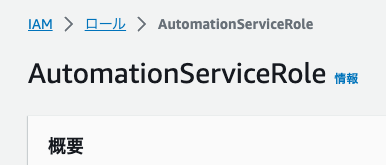

# Automation を使った運用自動化

Automation は、リソースの管理・設定を自動化する機能です。  
ランブックは複数のタスクにより構成可能で様々なニーズに対応します。  

## AWS 管理ランブックを実行してみよう

ユーザーが Automation を使って AWS 管理をしやすいよう事前定義済みランブックが用意されています。  
一般的なメンテナンスタスクの実行が想定されています。  

### サービスロール作成

Automation の実行はユーザーが行うわけではありません。  
サービスロールが肩代わりしてリソースの操作を行います。そのサービスロールを作成します。  

CloudShell で以下のコマンド実行します。  

```bash
wget https://docs.aws.amazon.com/systems-manager/latest/userguide/samples/AWS-SystemsManager-AutomationServiceRole.zip
unzip AWS-SystemsManager-AutomationServiceRole.zip 
```

zip が解凍されて `AWS-SystemsManager-AutomationServiceRole.yaml` がディレクトリに存在することを確認します。  

```bash
$ ls
AWS-SystemsManager-AutomationServiceRole.yaml  AWS-SystemsManager-AutomationServiceRole.zip
```

サービスロールを作成するコマンドを実行します。  

```bash
aws cloudformation create-stack --stack-name SSMHandson \
  --template-body file://AWS-SystemsManager-AutomationServiceRole.yaml \
  --capabilities CAPABILITY_NAMED_IAM
```

マネジメントコンソールで IAM ロール画面を開いてください。**AutomationServiceRole** というロールが作成されていることを確認します。  




### Automation を実行する

サービスロールが正しく作成できたら簡単な Automation を実行してみましょう。  

マネジメントコンソールで [Automation](https://us-east-1.console.aws.amazon.com/systems-manager/automation/execute) を開きます。  
Systems Manager 画面の左ペインにある **変更管理** → **オートメーション** からも遷移できます。  

検索ボックスに **AWS-StopEC2Instance** を入力します。  
検索結果に表示された **AWS-StopEC2Instance** をクリックします。  

別タブが開くはずです。右上の **オートメーションを実行する** をクリックします。  

中段あたりに **入力パラメータ** という段落があります。以下を選択します。  

| 設定項目             | 入力値                           |
| -------------------- | -------------------------------- |
| InstanceId           | ハンズオン用踏み台サーバーを選択 |
| AutomationAssumeRole | AutomationServiceRole を選択     |

その他はデフォルトのままで大丈夫です。**実行** をクリックします。  

マネジメントコンソールで EC2 画面を開きます。  
ハンズオン用踏み台サーバーのステータスを見てみましょう。停止済み になっているはずです。  

このように予め定義しておいたランブックを実行してオペレーションを自動化することが Automation の目的です。  

## ランブックを書いてみよう

AWS が用意しているランブックだけでは自社の運用が回らない可能性はあります。  
自社に合わせたランブックを書いて実行することで効率良い運用を実現します。  

ランブックを書いてみましょう。  
[AWS-ResizeInstance](https://docs.aws.amazon.com/ja_jp/systems-manager-automation-runbooks/latest/userguide/automation-aws-resizeinstance.html) というランブックを参考にしながら記述方法を学びます。  

```YAML
---
description: Resize an EC2 instance
schemaVersion: "0.3"
assumeRole: "{{ AutomationAssumeRole }}"
parameters:
  InstanceId:
    type: String
    description: (Required) The Id of the instance
  InstanceType: 
    type: String
    description: (Required) The desired instance type
  SleepWait:
    type: String
    default: "PT5S"
    description: (Optional) The desired wait time before starting instance
    allowedPattern: "^PT([0-9]{1,6}S|[0-9]{1,5}M|[0-9]{1,3}H)$|^PD[0-7]$"
  AutomationAssumeRole:
    type: String
    description: (Optional) The ARN of the role that allows Automation to perform the actions on your behalf.
    default: ""
mainSteps:
  - name: assertInstanceType
    action: aws:assertAwsResourceProperty
    inputs: 
      Service: EC2 
      Api: DescribeInstances
      InstanceIds:
        - "{{InstanceId}}"
      PropertySelector: "$.Reservations[0].Instances[0].InstanceType"
      DesiredValues: ["{{InstanceType}}"]
    onFailure: step:stopInstance
    isCritical: false
    isEnd: true 
  - name: stopInstance
    action: aws:changeInstanceState
    inputs: 
      InstanceIds: 
        - "{{InstanceId}}"
      DesiredState: stopped 
  - name: resizeInstance 
    action: aws:executeAwsApi
    inputs:
      Service: EC2 
      Api: ModifyInstanceAttribute
      InstanceId: "{{InstanceId}}"
      InstanceType: 
        Value: "{{InstanceType}}"
  - name: wait
    action: aws:sleep
    inputs:
      Duration: "{{SleepWait}}"
  - name: startInstance
    action: aws:changeInstanceState 
    inputs:
      InstanceIds:
        - "{{InstanceId}}"
      DesiredState: running 
```

### データ要素とパラメータ

```YAML
description: Resize an EC2 instance
schemaVersion: "0.3"
assumeRole: "{{ AutomationAssumeRole }}"
parameters:
  SleepWait:
    type: String
    default: "PT5S"
    description: (Optional) The desired wait time before starting instance
    allowedPattern: "^PT([0-9]{1,6}S|[0-9]{1,5}M|[0-9]{1,3}H)$|^PD[0-7]$"
```

**description** にはランブックの説明を記述します。何を実行しているのか他人に理解しやすい説明を書きましょう。  

**schemaVersion** は 0.3 固定です。余談ですが、RunCommand は 2.2 となっています。  

**assumeRole** には Automation が引き受けるロールを指定します。ランブックに対応した最小権限を持ったロールをランブックごとに作成するようにしましょう。    

**parameters** にはランブックに渡すパラメータを定義します。インスタンス ID や希望する値など可変要素はパラメータで定義し、実行時に指定するようにします。  
変数型は String、StringList、Integer、Boolean、MapList、StringMap を使用できます。  
default を使って初期値を定義したり、allowPattern を使って入力値の制限をかけることも可能です。  

### 処理

```YAML
mainSteps:
  - name: assertInstanceType
    action: aws:assertAwsResourceProperty
    inputs: 
      Service: EC2 
      Api: DescribeInstances
      InstanceIds:
        - "{{InstanceId}}"
      PropertySelector: "$.Reservations[0].Instances[0].InstanceType"
      DesiredValues: ["{{InstanceType}}"]
    onFailure: step:stopInstance
    isCritical: false
    isEnd: true 
```

**mainSteps** ブロックにランブックの処理を記述します。  
基本的に書かれている順番、上から順に実行されます。  

**name** はステップ名を記述します。そのステップが何を実行しているか判別しやすい名称にしましょう。ランブック内で一意である必要があります。  

**action** ではサポートされているアクションタイプを指定します。
全てのアクションタイプは [Systems Manager Automation アクションのリファレンス](https://docs.aws.amazon.com/ja_jp/systems-manager/latest/userguide/automation-actions.html) を参照ください。  

**input** ではアクションタイプ固有のプロパティを指定します。ここでランブックで指定したパラメータを渡すことが多いです。

**onFailure** はステップが失敗した際の挙動を定義します。Abort(中止)、Continue(続行)、step(別のステップに移行) から選択します。  
上に示している AWS-ResizeInstance の例だと、ステップ:assertInstanceType で現在のインスタンスサイズとパラメータのインスタンスサイズを比較し、一致なら成功でランブック終了、失敗なら後続ステップへ移行を onFailure で表現しています。  

**isCritical** はクリティカルなステップに指定します。そのステップが失敗した場合、ランブックも失敗になります。  

**isEnd** はランブックの終了を意味します。  

### 役に立つユーザーガイド

[独自のランブックの作成](https://docs.aws.amazon.com/ja_jp/systems-manager/latest/userguide/automation-documents.html)  
[Systems Manager Automation ランブックのリファレンス](https://docs.aws.amazon.com/ja_jp/systems-manager-automation-runbooks/latest/userguide/automation-runbook-reference.html)  
[ドキュメントコンポーネント](https://docs.aws.amazon.com/ja_jp/systems-manager/latest/userguide/documents-components.html)  

## 解説

Automation の実行を試しました。実行を引き受けるサービスロールを作成し必要な権限を付与します。Automation には引数を渡し希望の状態になるよう実行します。    

[Systems Manager Automation アクションのリファレンス](https://docs.aws.amazon.com/ja_jp/systems-manager/latest/userguide/automation-actions.html) を見ながらランブックを書くことになると思います。  
慣れないうちは AWS が作った既存のランブックをコピーし、少しずつカスタマイズながら運用していくのが良いと思います。ランブックの文法は独自ですが慣れてしまえば難しくないと個人的には思います。    


 [前へ](./chapter05.md) &nbsp; &nbsp; &nbsp; &nbsp; &nbsp; &nbsp; &nbsp; &nbsp; [次へ](./chapter06.md) 
