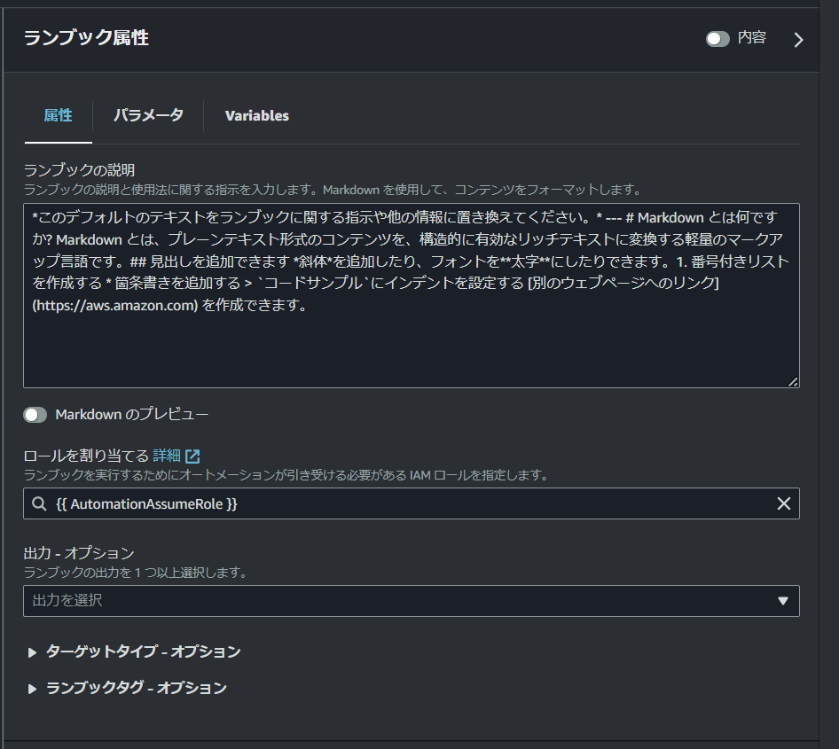
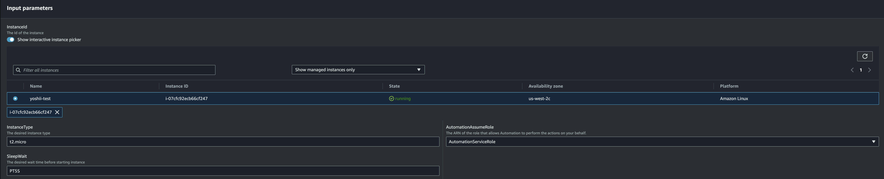

# Automation を使った運用自動化

Automation は、リソースの管理・設定を自動化する機能です。  
ランブックは複数のタスクにより構成可能で様々なニーズに対応します。  

## AWS 管理ランブックを実行してみよう

ユーザーが Automation を使って AWS 管理をしやすいよう事前定義済みランブックが用意されています。  
一般的なメンテナンスタスクの実行が想定されています。  

### サービスロール作成

Automation の実行はユーザーが行うわけではありません。  
サービスロールが肩代わりしてリソースの操作を行います。そのサービスロールを作成します。  

CloudShell で以下のコマンド実行します。  

```bash
wget https://docs.aws.amazon.com/systems-manager/latest/userguide/samples/AWS-SystemsManager-AutomationServiceRole.zip
unzip AWS-SystemsManager-AutomationServiceRole.zip 
```

zip が解凍されて `AWS-SystemsManager-AutomationServiceRole.yaml` がディレクトリに存在することを確認します。  

```bash
$ ls
AWS-SystemsManager-AutomationServiceRole.yaml  AWS-SystemsManager-AutomationServiceRole.zip
```

サービスロールを作成するコマンドを実行します。  

```bash
aws cloudformation create-stack --stack-name SSMHandson \
  --template-body file://AWS-SystemsManager-AutomationServiceRole.yaml \
  --capabilities CAPABILITY_NAMED_IAM
```

マネジメントコンソールで IAM ロール画面を開いてください。**AutomationServiceRole** というロールが作成されていることを確認します。  


作成後に以下のコマンドを実行します。  

```bash
cat > inline-policy.json << EOF
{
    "Version": "2012-10-17",
    "Statement": [
        {
            "Effect": "Allow",
            "Resource": "*",
            "Action": "ec2:ModifyInstanceAttribute"
        }
    ]
}
EOF

aws iam put-role-policy \
    --role-name AutomationServiceRole \
    --policy-name HandsonPolicy \
    --policy-document file://inline-policy.json
```


### Automation を実行する

サービスロールが正しく作成できたら簡単な Automation を実行してみましょう。  

マネジメントコンソールで [Automation](https://ap-northeast-1.console.aws.amazon.com/systems-manager/automation/execute) を開きます。  
Systems Manager 画面の左ペインにある **変更管理** → **オートメーション** からも遷移できます。  

**Execute automation** をクリックします。  

検索ボックスに **AWS-StopEC2Instance** を入力します。  
検索結果に表示された **AWS-StopEC2Instance** をクリックします。  

別タブが開くはずです。右上の **オートメーションを実行する** をクリックします。  

中段あたりに **入力パラメータ** という段落があります。以下を選択します。  

| 設定項目             | 入力値                           |
| -------------------- | -------------------------------- |
| InstanceId           | ハンズオン用踏み台サーバーを選択 |
| AutomationAssumeRole | AutomationServiceRole を選択     |

その他はデフォルトのままで大丈夫です。**実行** をクリックします。  

マネジメントコンソールで [EC2](https://ap-northeast-1.console.aws.amazon.com/ec2/home#Instances:)  画面を開きます。  
ハンズオン用踏み台サーバーのステータスを見てみましょう。停止済み になっているはずです。  
停止済みサーバーが確認できない場合 「インスタンスの状態 = running」 のようなフィルターにて表示対象が絞り込まれている場合があります。  
その場合は **フィルターをクリア** をクリックすることで絞り込みを解除できます。  

このように予め定義しておいたランブックを実行してオペレーションを自動化することが Automation の目的です。

### 踏み台サーバーの起動

後続のハンズオンで踏み台サーバーが起動している必要があるので、マネジメントコンソールから自分の踏み台サーバーを起動してください。

## ランブックを書いてみよう

2023年11月26日のアップデートで Automation の Visual Design ツールが発表されました。  
以前は YAML ファイルを書かなければならなかったのですが、D&D で Automation を書けるようになり大変便利になりました。ハンズオンでも Visual Design を使って Automation を書いてみましょう。  
以下は完成イメージです。  


本ハンズオンでは、EC2 インスタンスのインスタンスタイプ変更を Automation で記述します。  
希望のインスタンスタイプを指定、インスタンス停止した後にインスタンスタイプを変更、インスタンスを起動するという流れです。  

マネジメントコンソールで [Automation](https://ap-northeast-1.console.aws.amazon.com/systems-manager/automation) を開きます。  

**Create runbook** をクリックします。  

### ランブック名の定義

ランブックに名前をつけます。一意で識別しやすい名称が理想です。  
名称設定欄は左上にあります。「NewRunbook」が初期値で入っています。  

### 変数の定義

右側ペインの **ランブック属性** から **パラメータ** タブを開きます。  

以下の4つのパラメータを追加します。  

| パラメータ名         | タイプ | 必須 | デフォルト値（オプション） | 許可される値（オプション） | 許可されたパターン（オプション） | 説明（オプション）                                                                |
| -------------------- | ------ | ---- | -------------------------- | -------------------------- | -------------------------------- | --------------------------------------------------------------------------------- |
| InstanceId           | String | Yes  | （※必須がNOのみの項目）    |                            |                                  | The Id of the instance                                                            |
| InstanceType         | String | Yes  | （※必須がNOのみの項目）    |                            |                                  | The desired instance type                                                         |
| AutomationAssumeRole | String | No   |                            |                            |                                  | The ARN of the role that allows Automation to perform the actions on your behalf. |
| SleepWait            | String | No   | PT5S                       |                            |                                  | The desired wait time before starting instance                                    |


### 属性の定義

右側ペインの **ランブック属性** から **属性** タブを開きます。  

**Assume role** 欄に `{{AutomationAssumeRole}}` と入力します。  




### ステップ1

左側ペインの **アクション** タブの **リソース管理** 欄にある **プロパティをアサートします** をマウスでキャンバスにドロップします。  


ドロップした **AssertAWSResourceProperty** をクリックします。  

右側ペインの **AssertAWSResourceProperty** から **全般** タブを開きます。  

**ステップ名** を `assertInstanceType` に変更します。  

**インプット** タブを開きます。  

以下のように入力します。  

| 設定項目          | 入力値                                      |
| ----------------- | ------------------------------------------- |
| Service           | EC2                                         |
| API               | DescribeInstances                           |
| Property selector | $.Reservations[0].Instances[0].InstanceType |
| Desired values    | - '{{InstanceType}}'                        |
| InstanceIds       | - '{{InstanceId}}'                          |

`InstanceIds` は `その他の入力` から追加してください。

`Desired values`、`InstanceIds` の value はドロップダウンリストから選択すると配列形式とならないので、必ず `-` を入れて配列形式で指定してください。


### ステップ2

左側ペインの **アクション** タブの **リソース管理** 欄にある **インスタンスの状態を変更します** をマウスでキャンバスにドロップします。  
前の手順の **AssertAWSResourceProperty** と繋げます。  

ドロップした **ChangeInstanceState** をクリックします。  

右側ペインの **ChangeInstanceState** から **全般** タブを開きます。  

**ステップ名** を `stopInstance` に変更します。  

**インプット** タブを開きます。  

以下のように入力します。  

| 設定項目     | 入力値             |
| ------------ | ------------------ |
| InstanceIds  | - '{{InstanceId}}' |
| DesiredState | stopped            |

`InstanceIds`、`{{InstanceId}}` の value はドロップダウンリストから選択すると配列形式とならないので、必ず `-` を入れて配列形式で指定してください。


### ステップ3

左側ペインの **AWS APIs** タブの **Amazon EC2** 欄にある `Amazon EC2 ModifyInstanceAttribute` をマウスでキャンバスにドロップします。  
前の手順の **stopInstance** と繋げます。  

ドロップした **ModifyInstanceAttribute** をクリックします。  

右側ペインの **ChangeInstanceState** から **全般** タブを開きます。  

**ステップ名** を `resizeInstance` に変更します。  

**インプット** タブを開きます。  

以下のように入力します。  

| 設定項目     | 入力値                    |
| ------------ | ------------------------- |
| InstanceId   | {{InstanceId}}            |
| InstanceType | Value: '{{InstanceType}}' |

`InstanceType` は `その他の入力` から追加してください。


### ステップ4

左側ペインの **アクション** タブの **フロー** 欄にある **スリープ** をマウスでキャンバスにドロップします。  
前の手順の **resizeInstance** と繋げます。  

ドロップした **Sleep** をクリックします。  

右側ペインの **Sleep** から **全般** タブを開きます。  

**ステップ名** を `wait` に変更します。  

**インプット** タブを開きます。  

以下のように入力します。  

| 設定項目 | 入力値        |
| -------- | ------------- |
| Duration | {{SleepWait}} |


### ステップ5

左側ペインの **アクション** タブの **リソース管理** 欄にある **インスタンスの状態を変更します** をマウスでキャンバスにドロップします。  
前の手順の **wait** と繋げます。  

ドロップした **ChangeInstanceState** をクリックします。  

右側ペインの **ChangeInstanceState** から **全般** タブを開きます。  

**ステップ名** を `startInstance` に変更します。  

**インプット** タブを開きます。  

以下のように入力します。  

| 設定項目     | 入力値             |
| ------------ | ------------------ |
| InstanceIds  | - '{{InstanceId}}' |
| DesiredState | running            |

`InstanceIds`、`{{InstanceId}}` の value はドロップダウンリストから選択すると配列形式とならないので、必ず `-` を入れて配列形式で指定してください。


### ステップ6

ステップ1の **AssertAWSResourceProperty** をクリックします。  

**設定** タブを開きます。  

以下のように入力します。  

| 設定項目     | 入力値       |
| ------------ | ------------ |
| 失敗した場合 | stopInstance |
| クリティカル | false        |
| 次のステップ | 最後へ移動   |


### 完成形

デザイン画面の上部にある **コード** をクリックします。  

  

<br />
コード (yaml) が以下の通りであることを確認します。  

```yaml
schemaVersion: '0.3'
description: '*このデフォルトのテキストをランブックに関する指示や他の情報に置き換えてください。* --- # Markdown とは何ですか? Markdown とは、プレーンテキスト形式のコンテンツを、構造的に有効なリッチテキストに変換する軽量のマークアップ言語です。## 見出しを追加できます *斜体*を追加したり、フォントを**太字**にしたりできます。1. 番号付きリストを作成する * 箇条書きを追加する > `コードサンプル`にインデントを設定する [別のウェブページへのリンク](https://aws.amazon.com) を作成できます。'
parameters:
  InstanceId:
    type: String
    description: The Id of the instance
  InstanceType:
    type: String
    description: The desired instance type
  AutomationAssumeRole:
    type: String
    default: ''
    description: The ARN of the role that allows Automation to perform the actions on your behalf.
  SleepWait:
    type: String
    default: PT5S
    description: The desired wait time before starting instance
assumeRole: '{{AutomationAssumeRole}}'
mainSteps:
  - name: assertInstanceType
    action: aws:assertAwsResourceProperty
    isCritical: false
    isEnd: true
    onFailure: step:stopInstance
    inputs:
      Service: ec2
      Api: DescribeInstances
      PropertySelector: $.Reservations[0].Instances[0].InstanceType
      DesiredValues:
        - '{{InstanceType}}'
      InstanceIds:
        - '{{InstanceId}}'
  - name: stopInstance
    action: aws:changeInstanceState
    nextStep: resizeInstance
    isEnd: false
    inputs:
      InstanceIds:
        - '{{InstanceId}}'
      DesiredState: stopped
  - name: resizeInstance
    action: aws:executeAwsApi
    nextStep: wait
    isEnd: false
    inputs:
      Service: ec2
      Api: ModifyInstanceAttribute
      InstanceId: '{{InstanceId}}'
      InstanceType:
        Value: '{{InstanceType}}'
  - name: wait
    action: aws:sleep
    nextStep: startInstance
    isEnd: false
    inputs:
      Duration: '{{SleepWait}}'
  - name: startInstance
    action: aws:changeInstanceState
    isEnd: true
    inputs:
      InstanceIds:
        - '{{InstanceId}}'
      DesiredState: running
```

### 保存と実行

右上にある **ランブックを作成** をクリックします。
Automation ドキュメントが保存されました。  

作成したドキュメントを開きます。  
ドキュメントは、AWS Systems Manager の左ペインから ドキュメント を選択し、自己所有タブを開いたところに保存されています。  
右上にある **オートメーションを実行する** をクリックします。  

**Input parameters** に以下を入力します。  

| 設定項目             | 入力値                           |
| -------------------- | -------------------------------- |
| InstanceId           | ハンズオン用踏み台サーバーを選択 |
| InstanceType         | t2.micro                         |
| AutomationAssumeRole | AutomationServiceRole を選択     |
| SleepWait            | PT5S                             |



**Excute** をクリックします。  

しばらく待ちます。  

ステップ1の assertInstanceType は失敗します。それ以外のステップが成功したことを確認します。  

)

マネジメントコンソールで [EC2](https://ap-northeast-1.console.aws.amazon.com/ec2/home#Instances:) 画面を開いてください。該当 EC2 インスタンスのインスタンスタイプが変わっていることを確認します。  

うまく行かない場合は、ドキュメントを開き、コンテンツから見直してみてください。  
ドキュメントを修正する場合は、右上のアクションから「新しいバージョンを作成する」から編集し、バージョンを最新に設定したうえで、再度オートメーションを実行してください。

### 役に立つユーザーガイド

[独自のランブックの作成](https://docs.aws.amazon.com/ja_jp/systems-manager/latest/userguide/automation-documents.html)  
[Systems Manager Automation ランブックのリファレンス](https://docs.aws.amazon.com/ja_jp/systems-manager-automation-runbooks/latest/userguide/automation-runbook-reference.html)  
[ドキュメントコンポーネント](https://docs.aws.amazon.com/ja_jp/systems-manager/latest/userguide/documents-components.html)  

## 解説

Automation の実行を試しました。実行を引き受けるサービスロールを作成し必要な権限を付与します。Automation には引数を渡し希望の状態になるよう実行します。    

[Systems Manager Automation アクションのリファレンス](https://docs.aws.amazon.com/ja_jp/systems-manager/latest/userguide/automation-actions.html) を見ながらランブックを書くことになると思います。  
慣れないうちは AWS が作った既存のランブックをコピーし、少しずつカスタマイズながら運用していくのが良いと思います。ランブックの文法は独自ですが慣れてしまえば難しくないと個人的には思います。    


 [前へ](./chapter05.md) &nbsp; &nbsp; &nbsp; &nbsp; &nbsp; &nbsp; &nbsp; &nbsp; [次へ](./chapter06.md) 
